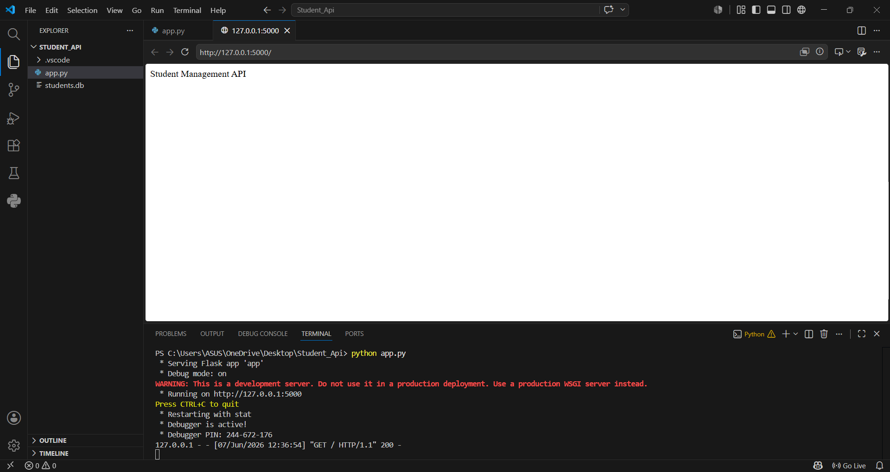
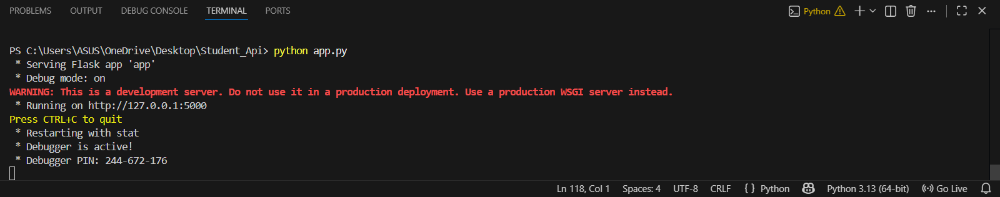
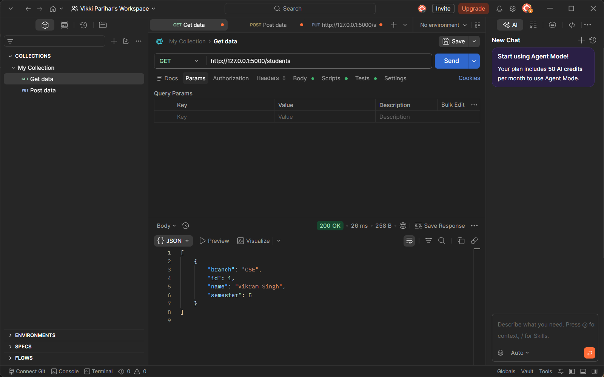
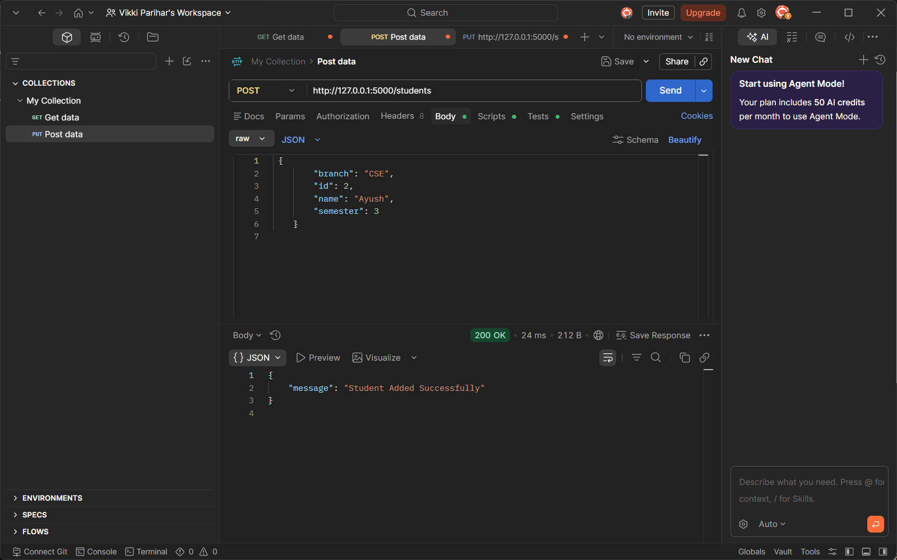
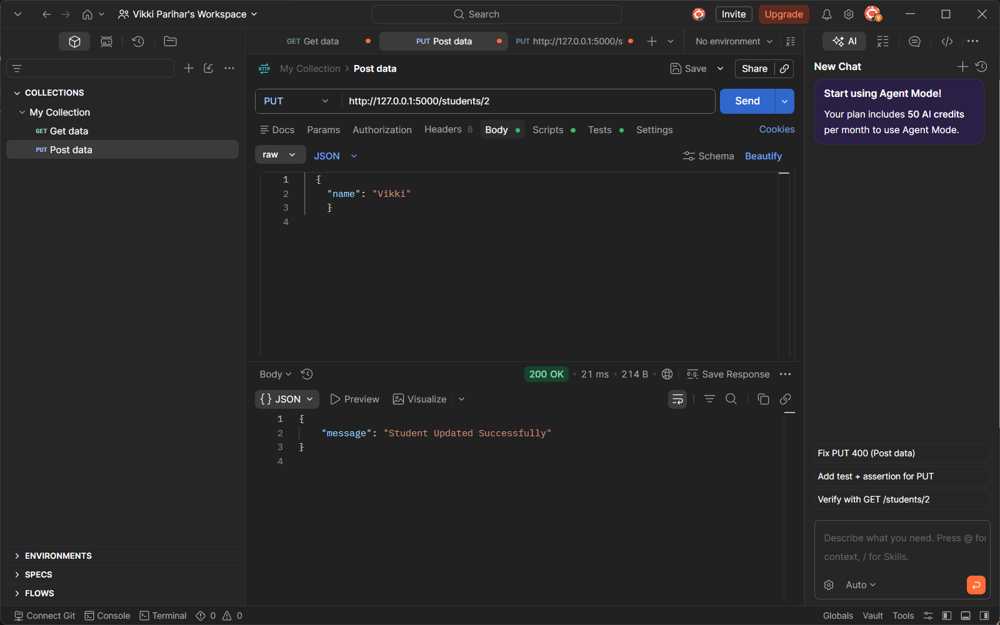
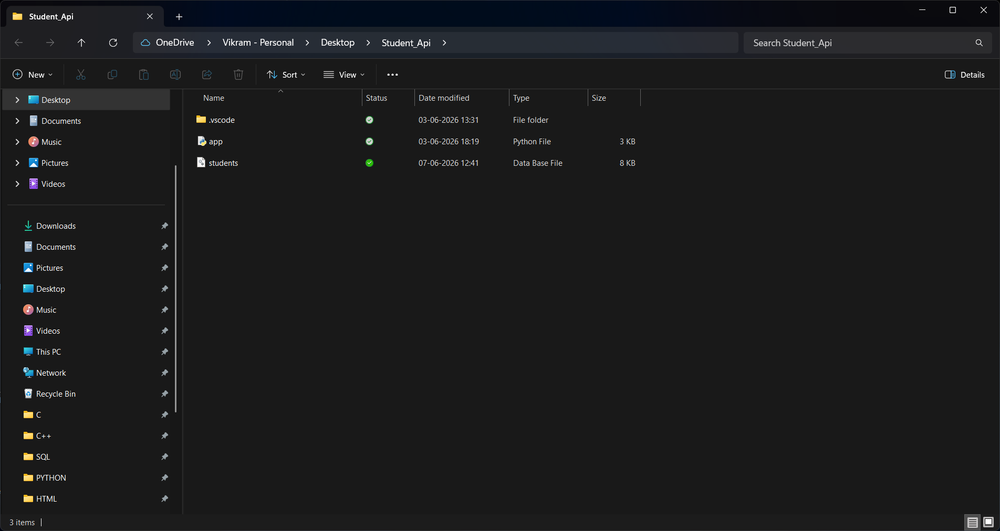

# 🎓 Student Management REST API

A **Student Management REST API** developed using **Python, Flask, and SQLite**. This project allows users to perform **CRUD (Create, Read, Update, Delete)** operations on student records using REST APIs. All student data is stored in an SQLite database and tested using Postman.

---

## 🚀 Features

- ➕ Add New Student
- 📋 View All Students
- ✏️ Update Student Details
- 🗑️ Delete Student
- 💾 SQLite Database Integration
- 🔄 RESTful API
- 📦 JSON Responses
- 🧪 API Testing using Postman

---

# 🛠️ Technologies Used

- Python 3
- Flask
- SQLite
- Postman
- VS Code
- Git
- GitHub

---

# 📂 Project Structure

```text
Student_Api/
│
├── app.py
├── students.db
├── requirements.txt
├── README.md
├── .gitignore
└── Screenshots/
    ├── home.png
    ├── terminal.png
    ├── get.png
    ├── post.png
    ├── put.png
    ├── delete.png
    └── project-structure.png
```

---

# 📸 Project Screenshots

## 🏠 Home Page



---

## 💻 Flask Server Running


---

## 📥 GET API Response



---

## ➕ POST API Response



---

## ✏️ PUT API Response



---

## 🗑️ DELETE API Response


---

## 📂 Project Structure



---

# 📡 API Endpoints

| Method | Endpoint | Description |
|--------|----------|-------------|
| GET | `/students` | Get all students |
| POST | `/students` | Add a new student |
| PUT | `/students/<id>` | Update student details |
| DELETE | `/students/<id>` | Delete student |

---

# 📝 Sample JSON

## POST Request

```json
{
  "id": 1,
  "name": "Vikram Singh",
  "branch": "CSE",
  "semester": 5
}
```

## Success Response

```json
{
  "message": "Student Added Successfully"
}
```

---

# ⚙️ Installation

## Clone Repository

```bash
git clone https://github.com/pariharvikki21-ctrl/Student-Management-REST-API.git
```

## Go to Project Folder

```bash
cd Student-Management-REST-API
```

## Install Dependencies

```bash
pip install -r requirements.txt
```

## Run the Application

```bash
python app.py
```

Server will start at:

```
http://127.0.0.1:5000
```

---

# 🧪 Testing

The API can be tested using:

- Postman
- Thunder Client
- Browser (GET Request)

---

# 🎯 Learning Outcomes

During this project I learned:

- Python Programming
- Flask Framework
- SQLite Database
- REST API Development
- CRUD Operations
- JSON Handling
- API Testing using Postman
- Git & GitHub
- Backend Development

---

# 🔮 Future Improvements

- User Authentication
- Login System
- JWT Authentication
- Password Encryption
- Search Student
- Pagination
- Swagger API Documentation
- MySQL Database Support
- Docker Deployment

---

# 👨‍💻 Author

**Vikram Singh**

🎓 Diploma in Computer Science Engineering

📍 Uttarakhand, India

GitHub:
https://github.com/pariharvikki21-ctrl

---

# ⭐ Support

If you found this project helpful, please consider giving it a **Star ⭐** on GitHub.

Thank you for visiting this repository!
If you like this project, don't forget to ⭐ Star this repository.
